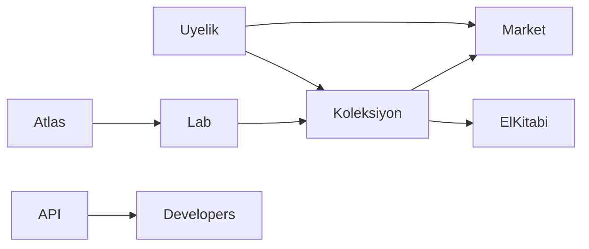

# Element Atlas de-slop + el kitabı + API ürünü planı

## Neden kotu duruyor (arastirma ozeti)

- Gokkusagi serit her sayfada: [web-app/src/design-system.css](web-app/src/design-system.css) L228-237 `workspace-toolbar::after` 7 renk gradient + L107-121 pembe `workspace-mark` rozeti. Screenshots'taki "design" hissi bu.
- Stok Spline 3D sahne resmi ornek dosya: [web-app/src/lib/motion.ts](web-app/src/lib/motion.ts) + [web-app/src/pages/Laboratory.tsx](web-app/src/pages/Laboratory.tsx) L57-63. Atom degil, ornek kureler.
- 4 katmanli CSS birbirini eziyor: [web-app/src/styles.css](web-app/src/styles.css) sirasi + [web-app/src/index.css](web-app/src/index.css) icinde ~3k satir olu commerce/periodic blogu + [web-app/src/science.css](web-app/src/science.css) ve [web-app/src/atlas.css](web-app/src/atlas.css) cakismalari (`body` zemini, `.science-tile` iki ayri tarif).
- Her sayfada ayni kart tarifi: `.learning-card` + shadcn `Card` sarmalayici Collection/Demo/Account/Feedback/Settings/DataCoverage/Lab/Market/Shop hepsinde. Tek tip sablon goruntusu buradan geliyor.
- `Sparkles` ikonu kesif kaydinda yapay zeka cagrismi yapiyor: [web-app/src/pages/Laboratory.tsx](web-app/src/pages/Laboratory.tsx) L381.
- Market bandi olu: [web-app/src/pages/Market.tsx](web-app/src/pages/Market.tsx) L206 diziyi ikiye katliyor ama [web-app/src/design-system.css](web-app/src/design-system.css) L1717 `animation: none` ile hareketsiz.
- Gecisler cift sistem ve eksik: route fade her yerde ayni ([web-app/src/App.tsx](web-app/src/App.tsx) L298-303), Tablo/Kartlar degisimi animasyonsuz, filtre/lens degisiminde tile gecisi yok, lab sonucu GSAP + CSS cift animasyon, liste stagger 20. ogede kesiliyor ([web-app/src/components/PeriodicExplorer.tsx](web-app/src/components/PeriodicExplorer.tsx)).
- `/dashboard` route'u yok. Hub gorevi gorenler: `/collection`, `/demo`, `/account`, `/`. Yeni route acmadan `/collection` panel kimligine kavuacak.
- Eksik asset'ler: `/og.png` referans var dosya yok ([web-app/src/components/Seo.tsx](web-app/src/components/Seo.tsx) L58), `public/media/atlas/` bosta; foto yoksa AtomShell/formul dusuyor, bu cogunlukla gorunuyor.
- Uyelik "neden" daginik: [web-app/src/pages/Register.tsx](web-app/src/pages/Register.tsx) sadece senkron diyor, 10.000 kredi + API anahtari sadece Shop/Account'ta; JWT sonra sessiz API anahtari adimi hic anlatilmiyor; misafir kesifler giriste otomatik birlesmiyor, sadece Collection'da buton var; oyun skorlari hesaba gitmiyor.
- API urun degil: v2 herkese acik ve iyi ama OpenAPI yok, `GET /api/v2/coverage` gateway'de yok, rate limit yazisi host'a gore yanlis (docs 300/dk diyor, gateway 100/10sn), webhook ve v1 yuzeyi `/docs`'ta yok, Ingilizce yok, kullanim sartlari yok.
- El kitabi parcali: Guide/About/Glossary ayni suyu-tuzu uc kez anlatiyor, Formula/Dedektif oyunlari Rehber'de yok, Market ana yolculukta yok, Rehber "More" menusune gomulu, [web-app/README.md](web-app/README.md) `/koleksiyonum` diyor gercek route `/collection`.

## Tasarim karari (senin secimine gore)

- Temel dil: Airbnb sicakligi. Neden: urun hem ogrenme hem pazar yeri; yuvarlak kartlar, sicak notr zemin, tek vurgu rengi ailesi, eglenceli ama tutarli. Apple soguk minimalizmi bu urune eglence katmaz.
- Hareket dili: Apple disiplini. Kisa spring gecisler (200-300ms), her degisimde ayni easing, `prefers-reduced-motion` saygisi.
- Yeni bagimlilik yok: framer-motion zaten kurulu, onunla devam; GSAP lab/kesif animasyonlarindan cekilir. Isin cogu silme: gokkusagi, rozet, Spline, olu CSS.

## Faz 1 - Gorsel de-slop (silme agirlikli)

- [web-app/src/design-system.css](web-app/src/design-system.css): gokkusagi `::after` bandini kaldir, `workspace-mark` rozeti sade metin kimlige indir, `.science-tile` pastel `color-mix` cift tarifini teke dusur, olu `.explorer-spline` stillerini sil, `.learning-card` tarifini 2 varyanta indir (kayit karti + uyari/not karti), Shop koyu fintech basligini kaldir.
- [web-app/src/styles.css](web-app/src/styles.css) + [web-app/src/index.css](web-app/src/index.css): olu commerce/periodic bloklarin yuklenmesini durdur, tek zemin + tek tipografi kaynagi birak; `science.css`/`atlas.css` override'larini bu karara gore buda.
- Spline'i kaldir: [web-app/src/lib/motion.ts](web-app/src/lib/motion.ts) URL'i, [web-app/src/pages/Laboratory.tsx](web-app/src/pages/Laboratory.tsx) L57-63 `SplineStage` sarimini sil; kesif gorseli foto varsa foto, yoksa AtomShell/formul zincirinde kalsin. `package.json`'da baska kullanim yoksa `@splinetool` bagimliligini dusur.
- Ikonlar: `Sparkles` yerine `FlaskConical` veya onay muhrusu; `Lightbulb` ipucu ikonunu tut.
- Periyot tablosu lens renkleri: `hsl` isisi haritasi yerine grup/blok gelenegine yakin tek palet ([web-app/src/components/PeriodicExplorer.tsx](web-app/src/components/PeriodicExplorer.tsx) L192-194).
- Market bandi karari: ya animasyonu geri ac ya `tape.concat(tape)` kopyalamasini sil ([web-app/src/pages/Market.tsx](web-app/src/pages/Market.tsx) L206).
- `og.png` uret veya referansi kaldir ([web-app/index.html](web-app/index.html), [web-app/src/components/Seo.tsx](web-app/src/components/Seo.tsx)); atlas foto `null`'larin cogunun bilinclilik hali oldugunu el kitabina yaz, lisanssiz gorsel cekme.

## Faz 2 - Yumusak gecisler (tek sistem: Framer)

- [web-app/src/App.tsx](web-app/src/App.tsx) `RouteStage`: her route'ta ayni fade+y yerine ogesine gore kisa varyant (liste sayfalari fade, detay sayfalari hafif yukari kayma), sure 200-260ms spring.
- [web-app/src/components/PeriodicExplorer.tsx](web-app/src/components/PeriodicExplorer.tsx): Tablo/Kartlar arasina `AnimatePresence` + layout gecisi, filtre/lens degisiminde tile opacity/renk transition, stagger sinirini kaldir veya sayfalama ile esitle, GSAP giris animasyonunu Framer'a tasi ya da sil.
- [web-app/src/pages/Laboratory.tsx](web-app/src/pages/Laboratory.tsx): `back.out(1.4)` ziplamayi sakin spring ile degistir, GSAP+CSS cift animasyonu teke indir.
- [web-app/src/components/LabModes.tsx](web-app/src/components/LabModes.tsx): aktif mod hapina kayan gosterge (`layoutId`) ekle.
- [web-app/src/components/SplineStage.tsx](web-app/src/components/SplineStage.tsx): Spline kalkinca bu bilesen ya silinir ya da foto/formul arasi 200ms crossfade yapan saf `VisualStage` olur.
- Tum yeni hareket `MotionConfig reducedMotion="user"` altinda kalir; `prefers-reduced-motion` medyalarini tek yerden topla.

## Faz 3 - El kitabi (tek hikaye: Atlas -> Lab -> Koleksiyon -> Market)

- [web-app/src/pages/Guide.tsx](web-app/src/pages/Guide.tsx) `/nasil`'i "ilk 10 dakika" kitabina cevir: Fe bul, H2O kur, ilk rotayi bitir, Formul kur + Dedektif oyna, defteri yedekle/hesapla esitle, (opsiyonel) Demo/Market'e gec. Her adim canli route'a derin baglanti verir.
- Ayni sayfaya SSS ekle: HO neden su degil, misafir verisi ne zaman silinir, 5080 atlas-only ile 3000 full farki, API calismazsa ne olur.
- Kesif paneli kimligi: `/collection` basligi ve bos-durum metni "Defterim / panelim" diliyle yazilir, yeni route acilmaz.
- `ProductShell` birincil veya ikincil nav'a "El kitabi" girisi + Landing'e `/nasil` cagrisi ekle; Rehber More menusunde gomulu kalmaz.
- Tekrari buda: Guide kutsal kaynak olur, About/Glossary ona baglanir, ayni su-tuz paragrafini uc yerde tutma.
- [web-app/README.md](web-app/README.md) `/koleksiyonum` -> `/collection` duzeltmesi.

## Faz 4 - Uyelik "neden" netligi (metin + kucuk UX)

- Tek deger cumlesi her yerde ayni: "Hesap ac: defterin cihazlar arasi esitlesin, 10.000 kredi ve API anahtari al, siparis gecmisini sakla."
- [web-app/src/pages/Register.tsx](web-app/src/pages/Register.tsx): kredi + anahtar + gecmis maddelerini ekle; [web-app/src/pages/Login.tsx](web-app/src/pages/Login.tsx): yeni kullaniciya ayni 3 madde; header'a kayit baglantisi ([web-app/src/components/ProductShell.tsx](web-app/src/components/ProductShell.tsx)); Landing'e hesap cagrisi.
- Giris sonrasi Collection'da misafir birlestirme uyarisini belirginlestir (otomatik birlestirme yapma, veri karisma riski; tek tikla tasi kalir).
- Hesap/Ayarlar ayrimini etiketle: Hesabim = cuzdan + anahtarlar + webhook; Ayarlar = profil + guvenlik + veri. Nav etiketleri bunu soylesin.
- Iki adimli anahtar hikayesini Account bos-durumunda acikla: giris JWT verir, ticaret anahtari otomatik uretilir.
- Oyun skorlarinin deftere gitmedigi ve girisliyken sifirlama gizliligini SSS'ye yaz.

## Faz 5 - API'yi gercek urun yap (sectigin yon)

- Yeni `/developers` sayfasi (TR govde + EN ozet): kim icin (uygulama gelistirici, veri kullanan ogretmen, teknik degerlendirici), ne verir (118 element + 167 bilesik, TR editoriyal + kaynakca, alan projeksiyonu, ETag), kullanim sartlari ozeti, degisiklik kaydi baglantisi.
- [web-app/src/pages/ApiDocs.tsx](web-app/src/pages/ApiDocs.tsx): EN bolum/ozet, host'a gore dogru rate limit metni (gateway 100/10sn, science 300/dk), webhook + v1 siparis/teslimat yuzeyi, `/coverage` notu, OpenAPI baglantisi.
- v2 OpenAPI ciktisi: `ScientificCatalog` kontratilindan uretilen `openapi.json` dosyasini sun + `/docs` ve `/developers`'tan bagla. Kapsam disi birakma: tam Swagger UI kurmak yerine statik dosya + playground yeter (YAGNI).
- `GET /api/v2/coverage` gateway'e ekle veya neden yoksa alternatifini dokumante et ([gateway-service/appsettings.json](gateway-service/appsettings.json), [gateway-service/README.md](gateway-service/README.md)).
- Kullanim sartlari + degisiklik kaydi: kisa `docs/API-TERMS.md` (toplu cekme kurali, kaynak gosterme) ve `docs/API-CHANGELOG.md`; repo lisansi disinda tuketici metni ilk kez yazilir.
- Anahtar cok-cihaz puruzu: "Web Dashboard Key" iptal davranisini duzelt veya UI'da uyar ([web-app/src/services/api.ts](web-app/src/services/api.ts)); P1 olarak isaretli.

## Dogrulama ve kapanis

- Hafif dogrulama: `cd web-app && npm run dev` gorsel tur, `dotnet build` tek servis, `npx tsc` order-service; tum dunyayi `--build` etme ([docs/memory-bank/local-dev.md](docs/memory-bank/local-dev.md)).
- Tek calistirilabilir kontrol: mevcut `web-app/tests/docs.test.mjs` yanina el kitabi baglanti + API ornek testi ekle (kopuk link ve ornek kalmamasini kilitler).
- Bitince [docs/memory-bank/recent-work.md](docs/memory-bank/recent-work.md), [docs/memory-bank/open-risks.md](docs/memory-bank/open-risks.md) ve [docs/WHAT-WAS-DONE.md](docs/WHAT-WAS-DONE.md) guncelle.