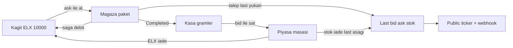

# ElementAPI — metal evi (borsa + mağaza + API)

## Neden önceki dilim azdı

Ticker + last’ten alış + doküman bir **vitrin**. Ekonomik döngü yoktu: satamıyorsun, elinde gram durmuyor, fiyat alımdan etkilenmiyor, kargo numarası siparişe yazılmıyor, ödeme rastgele “banka”.

Seçimin: **tam döngü**. Order book, kategori endeksi, sahte haber, izleme listesi yok. Dealer desk var.

**Model:** Elemental ev market maker. Last = mid. **Ask** = last × (1+spread), **bid** = last × (1−spread). Spread varsayılan %0.8. Sen evden alırsın, eve satarsın. Başka oyuncu defteri yok.

---

## Ürün yüzleri (aynı kayıt)

| Yüz | Ne görürsün | Para |
|-----|-------------|------|
| **Piyasa** `/market` | Ticker, bid/ask, grafik, hacim, **kasa + P&L**, Sat | Bid sat / ask’a mağaza |
| **Mağaza** `/shop` | 1/10/50/100 g paket, stok, sepet, kargo `TRK-` | Ask × gram, ELX cüzdan |
| **API** `/docs` | Canlı GET, key, try-it, webhook | Aynı ticker/order JSON |
| **Tablo** `/periodic` | Keşif + hücreler 24s Δ ile ısınır | — |

Nav: `Tablo · Piyasa · Mağaza · API`. Cüzdan bakiyesi topbar’da (girişli). `/values`→`/market`, `/trading`→`/shop`.

---

## 1. Defter — order-service (yeni servis yok)

[`order-service/src/db/pool.ts`](order-service/src/db/pool.ts) yanına tablolar:

- `wallets (user_id PK, balance_elx, updated_at)` — ilk `GET /me/wallet` yoksa **10_000 ELX** açar
- `holdings (user_id, symbol, grams, avg_cost_elx)` — P&L = `(last − avg_cost) × grams`
- `ledger (id, user_id, kind, elx, symbol, grams, order_id, created_at)` — `grant` / `buy` / `sell` / `refund`

API (gateway, API key, `X-User-Id`):

- `GET /api/v1/me/wallet`
- `GET /api/v1/me/holdings`
- `POST /api/v1/desk/sell` `{ symbol, grams }` → bid × gram, kasa ≥ grams, stok iade

Alış hâlâ `POST /api/v1/orders`. Fiyat **ask** (mağaza last kullanmasın). Yetersiz ELX → **402** henüz saga başlamadan (stok da ayırmasın). Saga yine çalışır; asıl kesinti ödeme worker’da da idempotent debit (çift kesilmesin: hold at POST + commit, ya da tek debit `order_id` unique).

**Lazy debit:** `POST /orders` bakiye kontrolü; gerçek kesinti payment worker’dan `POST order-service /internal/wallet/debit` (idempotent `order_id`). Fail → mevcut `PaymentFailedEvent` + stok release + debit yok. Completed → holding artır, `avg_cost` ağırlıklı ortalama. Refund path: `PaymentFailed` / `ShipmentFailed` zaten stok bırakıyor; debit olmuşsa `internal/wallet/credit` (ledger `refund`).

En temizi: debit **yalnız** payment anında. POST sadece `balance >= ask*g` kontrolü (yarış: ikinci sipariş 402/fail — ponytail, serializable wallet row yeter).

---

## 2. Ödeme worker ELX’e bağlanır

[`ProcessPaymentCommand`](shared-lib/Events/IntegrationEvents.cs) + `customerId`. Node saga zaten `customerId` biliyor; Java parse eder.

[`PaymentCommandListener`](payment-service/src/main/java/com/elementmarket/payment/messaging/PaymentCommandListener.java): rastgele `BANK_DECLINED` **kalkar**. Karar:

1. credit cap (50_000 ELX tek emir) kalsın
2. `order-service` internal debit; 402/yetersiz → `PaymentFailedEvent` `INSUFFICIENT_ELX`
3. aksi `PaymentProcessedEvent`

Polyglot vitrin durur; “banka” yalanı biter. `PAYMENT_DETERMINISTIC` anlamsızlaşır, silinir veya yok sayılır.

---

## 3. Bid/ask, satış, fiyatın alımdan etkilenmesi

Ticker public `GET /api/v1/elements/{symbol}/ticker`:

- `last`, `bid`, `ask`, `spreadPct`, `change24hPct`, `high24h`, `low24h`, `volume24hGrams`, `sparkline[]`, `availableStock`

Spread catalog config (`Market:SpreadPct: 0.008`). Bid/ask türetilir, tabloda tutulmaz.

`GET /api/v1/market/movers` — şerit + heatmap.

**Satış** saga değil. `POST /desk/sell` → order-service kasa/ELX → `ElementSoldEvent(symbol, grams, customerId)` → catalog:

- `StockWeightGrams += grams`
- last × `(1 − k × grams/stock)` (k ~ 0.04, tavan tek işlemde %3)
- history + `PriceUpdated`

**Alış etkisi:** [`OrderCompletedConsumer`](catalog-service/Element.Services.Element.Infrastructure/Messaging/Consumers/OrderCompletedConsumer.cs) stok düşerken last × `(1 + k × grams/stock)`. Simulator 15sn ±1.5% **durmaz** ama küçülür (±0.4%) ki ev alış/satışı görülsün; kapanmaz (piyasa ölü olmasın).

History 24s boşsa Δ `null`, yalan `+X% bugün` yok.

Redis evict REST key’leriyle aynı (`element:dto:`, `elements:list:`).

`OrderCompletedEvent`’e `CustomerId` eklemeye gerek yok holdings için — order-service Completed’ta kendi kasasını yazar. Catalog sadece stok+fiyat.

---

## 4. Piyasa UI

[`Values.tsx`](web-app/src/pages/Values.tsx) → `/market` masa:

- Ticker şerit (movers)
- Seçili: last, bid, ask, Δ, hacim, stok, grafik (gerçek timestamp)
- Kasa tablosu: sembol, gram, avg cost, mark (last), P&L
- Sat: gram → bid önizleme → `desk/sell`
- Al: mağazaya `?symbol=&grams=`
- Misafir ticker görür; kasa/sat giriş ister
- SignalR login şartı kalkar ([`App.tsx`](web-app/src/App.tsx))

[`PeriodicTable.tsx`](web-app/src/pages/PeriodicTable.tsx): hücre rengi 24s Δ (yeşil/kırmızı), title last. Endeks/haber yok.

Likidite-teminat tiyatrosu ve sahte JSON kalkar.

---

## 5. Mağaza

Paket **SKU tablosu değil**: 1 / 10 / 50 / 100 g chip → sepet `grams`. Birim her yerde gram.

- Ekleme `availableStock` ve **cüzdan ≥ ask × g** (girişli)
- PDP [`ElementDetail`](web-app/src/pages/ElementDetail.tsx) sepete ekler, ask gösterir
- Checkout `POST /orders` ask × g; UI “Saga” demez
- [`ShipmentDispatchedEvent.TrackingNumber`](shared-lib/Events/ShipmentDispatchedEvent.cs) order satırına yazılır (bugün parse edilip atılıyor)
- Gateway: `GET /api/v1/orders/:id` sahiplik; `GET /api/v1/shipments/track/:n` yalnız kendi kargon (shipment’ı proxy et, `customerId` doğrula)
- Takip UI: `Hazırlanıyor → Ödeme → Kargoda TRK- → Teslim`

Sahte “Yarın kapında” / uydurma iskonto: seed `commerce` veya simülasyon notu.

---

## 6. API sitesi + webhook

[`ApiDocs.tsx`](web-app/src/pages/ApiDocs.tsx):

- Canlı `GET /elements/au` (hardcode Au kalkar)
- Try-it key gönderir; ticker public, history/orders/sell key’li
- `/account` key list/üret/iptal; login key yağmuru yok
- `:5000/swagger`

**Webhook** (notification-service, JWT):

- `POST/GET/DELETE /api/v1/webhooks` `{ url, events: [price.updated, order.updated], secret }`
- Mevcut consumer’lar imzalı POST (`X-Element-Signature`)
- SSRF: https, private IP yok, timeout kısa, 10s retry 1 kez
- Gateway bu path’i identity/notification’a bağlar

GraphQL `elementPrice` ticker’a çekilebilir; playground şart değil, `/docs` yeterli.

---

## 7. Kilitleme (döngü internete çıkınca zorunlu)

- `docker-compose.public.yml` hostta `:3000`+`:5000`
- `POST /orders` `X-User-Id` zorunlu; `GET :id` sahiplik 404
- `rateLimitTps` 1–10; Redis down → 429
- Internal wallet/validate secret header
- Hub `SendMessage` yok; sipariş event’i başkasının listesini refetch etmesin
- CORS env, MIT LICENSE, README: kâğıt ELX, ev MM, eşleşme yok

---

## Bilinçli yok

Order book, limit emir, Stripe, tenant, OAuth, izleme listesi, kategori endeksi, sahte haber feed, OHLCV mum, Helm tamiri.

---

## Sıra

1. Wallet/holdings/ledger + GET ensure 10_000
2. Payment debit + ask’ten order + 402
3. Ticker bid/ask + sell + price impact + SignalR public
4. `/market` kasa + tablo heatmap + `/shop` paket/kargo
5. `/docs` + webhook + account
6. Public overlay + IDOR/TPS/LICENSE

Kontrol: kayıt ol → 10_000 ELX; Au 10 g ask’ten al → bakiye düşer, kasa 10 g, last hafif yükselir; bid’den sat → ELX döner, stok artar; ticker misafire açık; `TRK-` siparişte; webhook price.updated dener; `:5002` public’te kapalı.
