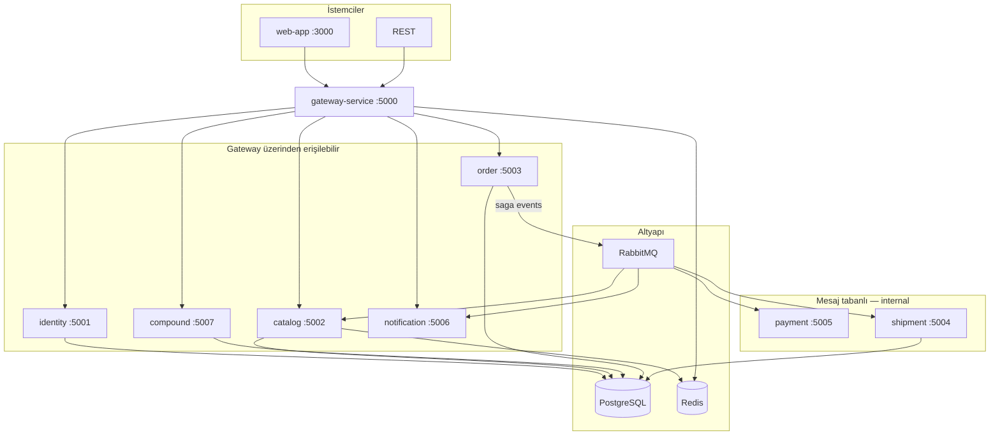

# ElementAPI

**Günlük maddelerin hangi elementlerden oluştuğunu keşfet; kısa rotalarla kimyayı anlamlandır.**

Türkçe kimya atlası, altı öğrenme rotası ve kişisel keşif koleksiyonu. 118 element ve 167 bileşik kaynaklarıyla sunulur. İlk keşif için hesap gerekmez. Açık API geliştirici yüzüdür; sanal ticaret ayrı teknik demodur.

**Yerel sunum — tek komut (Docker Desktop):**

```powershell
./deploy/scripts/present-platform.ps1
```

**http://localhost:3000** · her servis kendi konteynerinde (gateway, hesap, katalog, sipariş, ödeme, kargo, bildirim, web + PostgreSQL/Redis/RabbitMQ). Durdur: `./deploy/scripts/stop-local.ps1`.

**Yalnız atlas (DB/broker yok):** `./deploy/scripts/present-local.ps1` → **http://127.0.0.1:5080** · hesap ve ticaret kapalı; misafir koleksiyonu çalışır.

[Servis kılavuzu (insan dili)](docs/SERVIS-KILAVUZU.md) · [Üç dakikalık sunum](docs/LOCAL-PRESENTATION.md) · [Doğrulama](docs/PRODUCT-DELIVERY.md) · [Yol haritası](docs/PRODUCT-ROADMAP.md)

**Bilimsel katalog v2:** Referans periyodik tablo, anlatımlı element/bileşik kayıtları, laboratuvar keşfi (`/lab`), `view/include/fields`, ETag ve açık CORS. Canlı örnekler (Fe, H₂O, 400/404, ETag): uygulama `/docs`. Sözlük: `/sozluk`. Sözleşme: [Bilimsel katalog](deploy/scientific-catalog.md). Başlangıç: `GET /api/v2/elements/fe`, `GET /api/v2/compounds/h2o`.

118 elementin ve 167 bileşiğin kaynaklı bilimsel özellikleri için halka açık API; yanında fiyat tablosu, ürün mağazası ve kişisel kasa. **Kredi** uygulamanın sanal para birimidir. Piyasa fiyatları, stoklar, ödeme ve kargo simülasyondur; gerçek borsa verisi, tahsilat veya fiziksel teslimat yoktur.

Yerel geliştirme: **[localhost:5173](http://localhost:5173)** · API: **[localhost:5000/api/v1](http://localhost:5000/api/v1)**. Docker web sürümü 3000 portunu kullanır.

MIT lisansı: [LICENSE](./LICENSE).

**Son iş paketi (Atlas / `/lab` / infra sadeleştirme):** ayrıntılı Türkçe anlatım → [docs/WHAT-WAS-DONE.md](./docs/WHAT-WAS-DONE.md) · agent bellek bankası → [docs/memory-bank/](./docs/memory-bank/).

[](#servis-kataloğu)
[](#api-gateway)

---

## Hızlı başlangıç

### Tam platform (varsayılan)

Docker Desktop açıkken:

```powershell
# İlk kurulum: docker/.env.example → docker/.env (mevcut .env'i koru)
./deploy/scripts/present-platform.ps1
# veya
docker compose --env-file docker/.env up -d --build
```

| Adres | Ne için? |
|-------|----------|
| **[localhost:3000](http://localhost:3000)** | Tablo · Bileşikler · Laboratuvar (`/lab`) · Piyasa · Mağaza · API |
| [localhost:5000](http://localhost:5000) | API Gateway |
| [localhost:5000/swagger](http://localhost:5000/swagger) | Catalog OpenAPI (proxy) |

Hazır imajlarla yeniden aç: `./deploy/scripts/present-platform.ps1 -NoBuild`. Durdur: `./deploy/scripts/stop-local.ps1`. Verileri sil: `docker compose --env-file docker/.env down -v`. Host’ta 5432 doluysa `docker/.env` içinde `POSTGRES_HOST_PORT=5434`.

### Bağımsız atlas

```powershell
./deploy/scripts/present-local.ps1
```

**http://127.0.0.1:5080** — tek science imajı; PostgreSQL/Redis/RabbitMQ yok.

### Ön yüz geliştirme (isteğe bağlı, host)

Çalışan gateway’e karşı Vite: Node 22+ gerekir; tüm backend imajlarını yeniden derlemez.

```powershell
npm --prefix web-app ci
npm --prefix web-app run dev -- --host 127.0.0.1 --port 5173 --strictPort
```

### Kontrol

SMTP hariç genişletilmiş yerel doğrulama, gerçek hesap yaşam döngüsü ve beş veritabanında yedek/geri yükleme provası: [doğrulama kaydı](docs/LOCAL-VERIFICATION.md). `test-all.ps1 -Live` gerçek tarayıcı akışlarını da çalıştırır; `-Recovery` geri yükleme provasını ekler. E-posta sağlayıcısı tercihi Resend; henüz etkinleştirilmedi.

Yeni tarayıcı kontrolleri: `npm --prefix web-app run test:e2e` (gerçek bilimsel API) ve `npm --prefix web-app run test:e2e:auth` (hesap UI sözleşmeleri). Çalışan tam sunuma karşı `npm --prefix web-app run test:e2e:live` gerçek kayıt/eşitleme/sipariş akışını sınar. İlk kullanımda web-app içinde `npx playwright install chromium`. Java/Maven host'ta yoksa `test-all.ps1 -PaymentDocker` yalnız Maven/Java test konteynerini kullanır; `-Browser` tarayıcı kontrollerini de ekler.

Tüm yerel derleme, birim testi ve npm güvenlik kontrolleri için `./deploy/scripts/test-all.ps1`.
Docker üzerinde ayrı test konteynerleriyle entegrasyon için `-Integration`; çalışan yerel servislere karşı bilimsel API, alışveriş ve smoke kontrolleri için `-Live` ekleyin. Örneğin `./deploy/scripts/test-all.ps1 -Integration -Live`. Script Docker imajlarını yeniden derlemez; Java 21/Maven ve npm bağımlılıkları kurulu olmalıdır.

```powershell
./deploy/scripts/test-unit.ps1
npm --prefix order-service run check
./deploy/scripts/test-saga.ps1
node deploy/scripts/test-e2e.mjs
./deploy/scripts/test-smoke.ps1
npm --prefix web-app run build
npm --prefix web-app run lint
```

`test-saga.ps1`, gerçek PostgreSQL üzerinde geçici ve ayrı bir şemada çift ödeme, iade, zaman aşımı ve geç mesajları sınar; sonunda kendi şemasını kaldırır. `test-e2e.mjs` ve smoke testi çalışan yerel servislere bağlanır, ayrı deneme hesapları açar. Docker web sürümünü denemek için smoke testine `-WebBase http://localhost:3000` ver.

Tam Docker ortamı hazır olduğunda `node deploy/scripts/test-platform.mjs`, sekiz backend servisinin sağlık uçlarını, derlenmiş web sayfalarını (`/lab` dahil), REST ticker fiyatını ve gateway üzerinden gerçek SignalR fiyat olayını doğrular. Varsayılan web adresi `http://localhost:3000`; başka bir derlenmiş web sunucusu için `WEB_BASE` ortam değişkenini ayarlayın.

### Bilimsel veri ve alışveriş sözleşmesi

- Elementlerin kütle, yoğunluk, sıcaklık, elektron dizilimi ve elektronegatiflik verisi [PubChem periyodik tablosundan](https://pubchem.ncbi.nlm.nih.gov/periodic-table/) alınan sürümlenmiş dosyadan gelir. Yanıtlarda `sourceUrl`, `retrievedAt` ve `units` bulunur; kaynaktaki bilinmeyen değerler `null` kalır. Atom numarası 119 gibi varsayımsal kayıtlar yayımlanmaz.
- 167 bileşikte formül, molar kütle ve PubChem CID bulunur. 51 kayıt tam PubChem anlık görüntüsü + yapı görseli taşır; eklenenler eğitim kaydıdır (fiziksel/GHS alanları henüz dolu değil, yapı PNG yok). Allotrop ve preparatlar saf bir bileşik kaydı gibi sunulmaz. Mağaza SKU kataloğu ayrıdır.
- Atlas katmanı (Türkçe anlatım, görseller, Wikipedia/PubChem linkleri) `node deploy/scripts/refresh-atlas.mjs` ile yeniden uygulanır; bilimsel yenilemeden sonra otomatik çalışır. Medya indirme: `node deploy/scripts/refresh-atlas.mjs --fetch`.
- Veriyi bilinçli yenilemek için `node deploy/scripts/refresh-element-properties.mjs` ve `node deploy/scripts/refresh-compound-properties.mjs --force`; API çalışırken dış kaynağa bağımlı değildir.
- Siparişe gram cinsinden sayısal `quantity` gönderilir (en fazla dört ondalık). `Idempotency-Key` olarak aynı UUID ile tekrar gönderilen aynı sipariş yalnız bir kez ücretlendirilir; farklı içerik `409` döner.
- Kasadaki her ürün `symbol + compoundSlug` ile ayrılır. NaCl, saf Na gibi satılamaz. Satışta aynı `compoundSlug` gönderilir; alış ve satış fiyatı sunucuda hesaplanır. Başarısız/zaman aşımına uğramış siparişte ayrılan stok serbest bırakılır, tahsil edilmiş Kredi bir kez iade edilir.
- Para birimi kodu `KREDI`, fiyat kaynağı `simulation`dır. **Kasıtlı kırıcı rename yok:** wire/API alan adları ve reason kodları geçmişten kalan `*Elx` biçiminde kalır; değerler Kredi'dir. Korunan isimler: `balanceElx`, `avgCostElx`, `proceedsElx`, `requiredElx`, reason `INSUFFICIENT_ELX`, DB kolonları `balance_elx` / `avg_cost_elx` / `elx`. Yanıtta `currency: "KREDI"` ile doğrulayın. Bu paragraf tek kaynak gerçeğidir (servis README’leri buraya işaret eder).
- Cüzdan ve siparişler ortak yanıt önbelleğine girmez. Özel sipariş durumları herkese açık SignalR kanalında yayımlanmaz; istemci kendi siparişlerini kimlik doğrulayarak sorgular. İç servis çağrıları ayrıca paylaşılan servis anahtarı ister.

### Public yapılandırma taslağı

Web ve gateway yalnız loopback portlarına bağlanır; HTTPS reverse proxy ayrıca gerekir. Geliştirme sırları değiştirilmeden servisler Production modunda açılmaz:

```bash
cp docker/.env.example docker/.env
docker compose --env-file docker/.env -f docker-compose.yml -f docker-compose.public.yml up -d --build
```

Kayıt → `GET /api/v1/me/wallet` 10.000 kredi grant → mağazadan Au (ask) → kasa → masadan sat (bid).

---

## Mimari



### Saga akışı

```
POST /api/v1/orders  →  Submitted
  → catalog (stok ayır)  →  StockReserved
  → payment (ödeme)      →  PaymentProcessed
  → shipment (kargo)     →  ShipmentDispatched
  → Completed
```

---

## Servis kataloğu

Hangi kutu ne işe yarar: **[servis kılavuzu](docs/SERVIS-KILAVUZU.md)**. Her klasörün README’si aynı dilde, o kutuya özeldir.

| Servis | Port | Stack | Rol | Dokümantasyon |
|--------|------|-------|-----|---------------|
| **science-service** | 5080 | .NET 10 | Atlas tek kutu (DB yok) | [README](./science-service/README.md) |
| **gateway-service** | 5000 | .NET 10 YARP | Kapı, API anahtarı, hız sınırı | [README](./gateway-service/README.md) |
| **identity-service** | 5001 | .NET 10 | Hesap, JWT, anahtar, öğrenme | [README](./identity-service/README.md) |
| **catalog-service** | 5002 | .NET 10 | 118 element: bilim + sanal stok | [README](./catalog-service/README.md) |
| **compound-service** | 5007 | .NET 10 | Eğitim bileşiği ≠ mağaza SKU | [README](./compound-service/README.md) |
| **order-service** | 5003 | Node.js 22 | Cüzdan, alış/satış, saga | [README](./order-service/README.md) |
| **shipment-service** | 5004 | .NET 10 | Sahte kargo + takip | [README](./shipment-service/README.md) |
| **payment-service** | 5005 | Java 21 | KREDI çekme işçisi | [README](./payment-service/README.md) |
| **notification-service** | 5006 | .NET 10 | Canlı fiyat / sipariş haberi | [README](./notification-service/README.md) |
| **web-app** | 3000 / 5173 | React + Vite | Tablo · laboratuvar · mağaza | [README](./web-app/README.md) |
| **shared-lib** | — | .NET 10 lib | Ortak olay ve sağlık uçları | [README](./shared-lib/README.md) |

---

## API Gateway — rota özeti

Gateway üzerinden (`localhost:5000`) erişilen rotalar:

| Rota | Hedef | Auth |
|------|-------|------|
| `GET /api/v1` | Catalog discovery | — |
| `GET /api/v2/elements/**` | Catalog (bilimsel) | Public (`fields` / ETag / CORS) |
| `GET /api/v2/compounds/**` | Compound (bilimsel) | Public |
| `GET /api/v1/elements/**` | Catalog | History API key; **ticker public** |
| `GET /api/v1/compounds/**` | Compound | Public |
| `GET /api/v1/market/**` | Catalog | Public (movers, board) |
| `POST /api/v1/auth/register\|login` | Identity | — |
| `* /api/v1/api-keys/**` | Identity | JWT |
| `* /api/v1/webhooks/**` | Identity | JWT |
| `* /api/v1/me/**`, `/desk/**` | Order | API key |
| `* /api/v1/orders/**` | Order | API key (`X-API-Key`) |
| `WS /hub/notifications` | Notification SignalR | — |

**Internal (gateway dışı):** payment, shipment saga worker'ları; identity `POST /api/v1/internal/api-keys/validate`.

Keşif: `GET http://localhost:5000/info` · RabbitMQ yönetim UI: `localhost:15672` (`docker/.env` kullanıcı/şifre)

---

## Standart operasyon endpoint'leri

Tüm backend servislerde tutarlı ops yüzeyi:

| Endpoint | Açıklama |
|----------|----------|
| `GET /info` | Servis adı, sürüm, ortam, link haritası |
| `GET /health` | Readiness (bağımlılıklar dahil) |
| `GET /health/live` | Liveness (process ayakta mı) |
| `GET /health/ready` | Readiness (DB, Redis, RabbitMQ…) |

Payment ek olarak: `/actuator/health/liveness`, `/actuator/health/readiness`

Prometheus `/metrics`, HealthChecks UI (`/health-ui`) ve ELK/Grafana yığını **bilinçli olarak kaldırıldı**; bu uçlar 404 beklenir.

---

## Veritabanları

Tek Postgres instance, ayrı veritabanları:

| DB | Servis |
|----|--------|
| `element_identity_db` | identity-service |
| `element_market_db` | catalog-service |
| `element_compound_db` | compound-service |
| `element_order_db` | order-service |
| `element_shipment_db` | shipment-service |

---

## Geliştirme

```bash
./deploy/scripts/build-all.ps1
./deploy/scripts/test-unit.ps1
./deploy/scripts/test-smoke.ps1   # Yerel servisler ayaktayken smoke test
```

Günlük UI: çalışan kapıya karşı host Vite (`web-app` README). Tek servis için o klasörün README’si. Platformu her CSS satırında `docker compose up --build` etme. Ayrıntı: [servis kılavuzu](docs/SERVIS-KILAVUZU.md).

---

## Public / subdomain

Kâğıt kredi **para değildir**. Ev piyasa yapıcısı; emir defteri ve eşleştirme yok. MIT: [LICENSE](./LICENSE).

**Public overlay** (host’ta yalnızca `:3000` + `:5000`; DB portları kapalı). Bu makine için alan adı **https://elements-api.ahmetfuzunkaya.com** — adım adım: [docs/PUBLIC-HOST.md](docs/PUBLIC-HOST.md) (`docker/.env.public.example` + `deploy/Caddyfile.elements-api.example`).

```bash
cp docker/.env.public.example docker/.env   # sırları değiştir (≥32, ChangeMe yok)
docker compose --env-file docker/.env -f docker-compose.yml -f docker-compose.public.yml up -d --build
```

TLS compose’da yok — host Caddy (`deploy/Caddyfile.elements-api.example`). Compose `:443` bağlama.

| Env | Ne işe yarar |
|-----|----------------|
| `VITE_PUBLIC_SITE_URL` | Canonical, Open Graph, sitemap. **Build arg** — değişince web-app rebuild. |
| `VITE_API_BASE_URL` | Tarayıcının çağırdığı **public gateway** (`…/api/v1`). Rebuild. |
| `PUBLIC_WEB_ORIGIN` | Gateway + notification CORS (SignalR dahil). Runtime. |
| `PUBLIC_API_BASE` | Catalog HATEOAS (`X-Forwarded-Host` gelmezse). Gateway origin, `/api/v1` yok. |
| `PUBLIC_SITE_URL` | Container start’ta `robots.txt` / `sitemap.xml` `__SITE_URL__` yerini doldurur (compose bunu `VITE_PUBLIC_SITE_URL` ile set eder). |

JWT `localStorage`’da; origin-scoped. Cookie auth yok.

**Tek host** (`https://market.example.com` → UI `/`, API `/api` + `/hub`):

```
PUBLIC_WEB_ORIGIN=https://market.example.com
VITE_PUBLIC_SITE_URL=https://market.example.com
VITE_API_BASE_URL=https://market.example.com/api/v1
PUBLIC_API_BASE=https://market.example.com
```

**İki subdomain** (`app` + `api`):

```
PUBLIC_WEB_ORIGIN=https://app.example.com
VITE_PUBLIC_SITE_URL=https://app.example.com
VITE_API_BASE_URL=https://api.example.com/api/v1
PUBLIC_API_BASE=https://api.example.com
```

Reverse-proxy `X-Forwarded-Host` / `X-Forwarded-Proto` geçirmeli; yoksa `PUBLIC_API_BASE` linkleri düzeltir.

SPA: `index.html` varsayılan meta taşır; rota başlıkları istemcide `Seo` ile yazılır. `robots.txt` + `sitemap.xml` (`/lab`, bileşikler, 118 `/element/{symbol}`) nginx’ten statik.

---

## Dizin yapısı

```
element-api/
├── science-service/     gateway-service/     identity-service/
├── catalog-service/     compound-service/    order-service/
├── shipment-service/    payment-service/     notification-service/
├── web-app/             shared-lib/
├── deploy/              docker/
├── docker-compose.yml   docker-compose.science.yml
├── docs/SERVIS-KILAVUZU.md
└── README.md
```

## Ön yüz ve ürün senaryoları

Ön yüz shadcn/ui, Radix ve Tailwind 4 ortak bileşenleriyle düzenlenmiştir. [Ürün senaryoları](docs/PRODUCT-SCENARIOS.md), [tasarım sistemi](docs/memory-bank/design-system.md) ve [güncel memory bank](docs/memory-bank/README.md) devam çalışmaları için başlangıç noktasıdır.
