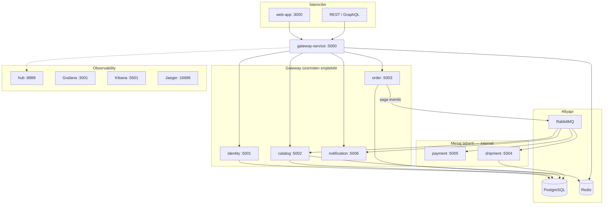

# Element Market

> Polyglot mikroservis platformu — periyodik tablo element ticareti, dağıtık saga, API gateway ve tam observability stack.

[](#servis-kataloğu)
[](#api-gateway)
[](#observability)

---

## Hızlı başlangıç

```bash
cp docker/.env.example docker/.env
docker compose --env-file docker/.env up -d --build
```

| Adres | Ne için? |
|-------|----------|
| **[localhost:8888](http://localhost:8888)** | Kontrol paneli — tüm UI bağlantıları |
| [localhost:3000](http://localhost:3000) | Web mağaza arayüzü |
| [localhost:5000](http://localhost:5000) | API Gateway (REST) |
| [localhost:5000/health-ui](http://localhost:5000/health-ui) | Tüm servislerin sağlık paneli |
| [localhost:5002/swagger](http://localhost:5002/swagger) | Catalog OpenAPI |

Durdurma: `docker compose down` · Verileri sil: `docker compose down -v`

---

## Mimari



### Saga akışı

```
POST /api/v1/orders  →  Submitted
  → catalog (stok ayır)  →  StockReserved
  → payment (ödeme)      →  PaymentProcessed
  → shipment (kargo)     →  ShipmentDispatched
  → Completed
```

---

## Servis kataloğu

Her servisin kendi README'si endpoint tabloları, ortam değişkenleri ve tek başına çalıştırma adımlarını içerir.

| Servis | Port | Stack | Rol | Dokümantasyon |
|--------|------|-------|-----|---------------|
| **gateway-service** | 5000 | .NET YARP + GraphQL | Tek giriş, API key, rate limit | [README](./gateway-service/README.md) |
| **identity-service** | 5001 | .NET 9 | Auth, JWT, API anahtarları | [README](./identity-service/README.md) |
| **catalog-service** | 5002 | .NET 9 | Element kataloğu, arama, stok | [README](./catalog-service/README.md) |
| **order-service** | 5003 | Node.js 22 | Sipariş + saga orkestrasyonu | [README](./order-service/README.md) |
| **shipment-service** | 5004 | .NET 9 | Kargo worker + sorgu API | [README](./shipment-service/README.md) |
| **payment-service** | 5005 | Java 21 | Ödeme worker | [README](./payment-service/README.md) |
| **notification-service** | 5006 | .NET 9 | SignalR push bildirimleri | [README](./notification-service/README.md) |
| **web-app** | 3000 | React + Vite | Mağaza UI | [README](./web-app/README.md) |
| **shared-lib** | — | .NET lib | Ortak event, logging, ops | [README](./shared-lib/README.md) |
| **contracts** | — | JSON şemalar | Polyglot mesaj sözleşmeleri | [README](./contracts/README.md) |

---

## API Gateway — rota özeti

Gateway üzerinden (`localhost:5000`) erişilen rotalar:

| Rota | Hedef | Auth |
|------|-------|------|
| `GET /api/v1` | Catalog discovery | — |
| `GET /api/v1/elements/**` | Catalog | History için API key |
| `GET /api/v1/elements/search?q=` | Catalog arama | — |
| `GET /api/v1/categories/**` | Catalog | — |
| `GET /api/v1/statistics/**` | Catalog istatistik | — |
| `POST /api/v1/auth/register\|login` | Identity | — |
| `* /api/v1/api-keys/**` | Identity | JWT |
| `* /api/v1/orders/**` | Order | API key (`X-API-Key`) |
| `WS /hub/notifications` | Notification SignalR | — |
| `POST /graphql` | Gateway BFF | — |

**Internal (gateway dışı):** payment, shipment saga worker'ları; identity `POST /api/v1/internal/api-keys/validate`.

Keşif: `GET http://localhost:5000/info` · Sağlık UI: `/health-ui`

---

## Standart operasyon endpoint'leri

Tüm backend servislerde tutarlı ops yüzeyi:

| Endpoint | Açıklama |
|----------|----------|
| `GET /info` | Servis adı, sürüm, ortam, link haritası |
| `GET /health` | Readiness (bağımlılıklar dahil) |
| `GET /health/live` | Liveness (process ayakta mı) |
| `GET /health/ready` | Readiness (DB, Redis, RabbitMQ…) |
| `GET /metrics` | Prometheus scrape (.NET, Node) |
| `GET /actuator/prometheus` | Prometheus (payment-service) |

Payment ek olarak: `/actuator/health/liveness`, `/actuator/health/readiness`

---

## Observability

Platform `docker compose up` ile izleme stack'ini birlikte başlatır.

| Araç | Port | UI? | Rol |
|------|------|-----|-----|
| **Kontrol paneli** | 8888 | ✅ | Tüm UI bağlantıları |
| Grafana | 3001 | ✅ | Metrik + log dashboard (`admin/admin`) |
| Kibana | 5601 | ✅ | ELK log arama |
| Jaeger | 16686 | ✅ | Distributed tracing |
| Seq | 5341 | ✅ | .NET yapılandırılmış loglar |
| Prometheus | 9090 | ✅ | Metrik sorguları |
| RabbitMQ | 15672 | ✅ | Kuyruk yönetimi (`guest/guest`) |
| Elasticsearch | 9200 | ❌ JSON | Depolama → Kibana kullan |
| Loki | 3100 | ❌ | Depolama → Grafana Explore |

Kibana index pattern'leri `kibana-setup` ile otomatik: `element-app-logs-*`, `element-logs-*`, `element-metrics-*`.

```bash
# docker/.env.example
SEQ_URL=http://seq:80
OTLP_ENDPOINT=http://jaeger:4317
LOGSTASH_HTTP_URL=http://logstash:8080
```

Konfig: `docker/observability/`

---

## Veritabanları

Tek Postgres instance, ayrı veritabanları:

| DB | Servis |
|----|--------|
| `element_identity_db` | identity-service |
| `element_market_db` | catalog-service |
| `element_order_db` | order-service |
| `element_shipment_db` | shipment-service |

---

## Geliştirme

```bash
./deploy/scripts/build-all.ps1
./deploy/scripts/test-unit.ps1
./deploy/scripts/test-smoke.ps1   # Stack ayaktayken smoke test
```

Tek servis: ilgili klasörde `docker compose up -d --build` (kendi README'sine bakın).

---

## Dizin yapısı

```
element-api/
├── gateway-service/     identity-service/    catalog-service/
├── order-service/       shipment-service/    payment-service/
├── notification-service/  web-app/           shared-lib/
├── contracts/           deploy/              docker/
├── docker-compose.yml   docker/.env.example
└── README.md            ← bu dosya
```
