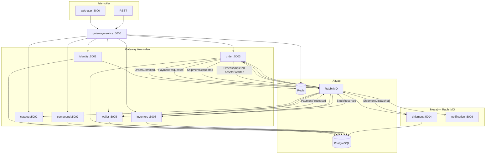

# ElementAPI

Günlük maddelerin hangi elementlerden oluştuğunu keşfet; kısa rotalarla kimyayı anlamlandır.

Türkçe kimya atlası, altı öğrenme rotası ve kişisel keşif koleksiyonu. 118 element, 167 bileşik. İlk keşif için hesap gerekmez. Açık API geliştirici yüzü; sanal ticaret ayrı bir demo (gerçek para / kargo yok).

**Yerel sunum — tek komut (Docker Desktop):**

```powershell
./deploy/scripts/present-platform.ps1
```

**http://localhost:3000** — her servis kendi konteynerinde (gateway, identity, catalog, compound, order, wallet `:5005`, inventory `:5008`, shipment, notification, web + PostgreSQL/Redis/RabbitMQ). Durdur: `./deploy/scripts/stop-local.ps1`.

**Yalnız atlas (DB/broker yok):** `./deploy/scripts/present-local.ps1` → **http://127.0.0.1:5080** · hesap ve ticaret kapalı; misafir koleksiyonu çalışır.

Hangi kutu ne işe yarar → [servis kılavuzu](docs/SERVIS-KILAVUZU.md) (samimi tur). Her klasörün `README.md`’si o kutunun kullanım kılavuzu. Operatör: [deploy/](deploy/README.md) · env: [docker/](docker/README.md) · belge indeksi: [docs/](docs/README.md). Ayrıca: [üç dakikalık sunum](docs/LOCAL-PRESENTATION.md) · [doğrulama](docs/PRODUCT-DELIVERY.md) · [yol haritası](docs/PRODUCT-ROADMAP.md).

**Bilimsel katalog v2:** Periyodik tablo, anlatımlı kayıtlar, laboratuvar (`/lab`), `view/include/fields`, ETag, açık CORS. Canlı örnekler uygulamada `/docs`. Sözlük: `/sozluk`. Sözleşme: [Bilimsel katalog](deploy/scientific-catalog.md). Başlangıç: `GET /api/v2/elements/fe`, `GET /api/v2/compounds/h2o`.

Para birimi ekranda **KREDI**. Piyasa, stok, ödeme ve kargo simülasyon; gerçek borsa / tahsilat / fiziksel teslimat yok. Kablodaki `*Elx` alan adları bilinçli eski isimlerdir (aşağıdaki sözleşme).

Yerel geliştirme: **[localhost:5173](http://localhost:5173)** · API kapısı: **[localhost:5000](http://localhost:5000)**. Docker web sürümü `:3000`.

MIT lisansı: [LICENSE](./LICENSE).

**Son iş paketi (Atlas / `/lab` / infra sadeleştirme):** ayrıntılı Türkçe anlatım → [docs/WHAT-WAS-DONE.md](./docs/WHAT-WAS-DONE.md) · agent bellek bankası → [docs/memory-bank/](./docs/memory-bank/).

[](#servis-kataloğu)
[](#api-gateway)

---

## Hızlı başlangıç

### Tam platform (varsayılan)

Docker Desktop açıkken:

```powershell
# İlk kurulum: docker/.env.example → docker/.env (mevcut .env'i koru)
./deploy/scripts/present-platform.ps1
# veya
docker compose --env-file docker/.env up -d --build
```

| Adres | Ne için? |
|-------|----------|
| **[localhost:3000](http://localhost:3000)** | Tablo · Bileşikler · Laboratuvar (`/lab`) · Piyasa · Mağaza · API |
| [localhost:5000](http://localhost:5000) | API Gateway |
| [localhost:5000/swagger](http://localhost:5000/swagger) | Catalog OpenAPI (proxy) |

Hazır imajlarla yeniden aç: `./deploy/scripts/present-platform.ps1 -NoBuild`. Durdur: `./deploy/scripts/stop-local.ps1`. Verileri sil: `docker compose --env-file docker/.env down -v`. Host’ta 5432 doluysa `docker/.env` içinde `POSTGRES_HOST_PORT=5434`.

### Bağımsız atlas

```powershell
./deploy/scripts/present-local.ps1
```

**http://127.0.0.1:5080** — tek science imajı; PostgreSQL/Redis/RabbitMQ yok.

### Ön yüz geliştirme (isteğe bağlı, host)

Çalışan gateway’e karşı Vite: Node 22+ gerekir; tüm backend imajlarını yeniden derlemez.

```powershell
npm --prefix web-app ci
npm --prefix web-app run dev -- --host 127.0.0.1 --port 5173 --strictPort
```

### Kontrol

SMTP hariç genişletilmiş yerel doğrulama, gerçek hesap yaşam döngüsü ve beş veritabanında yedek/geri yükleme provası: [doğrulama kaydı](docs/LOCAL-VERIFICATION.md). `test-all.ps1 -Live` gerçek tarayıcı akışlarını da çalıştırır; `-Recovery` geri yükleme provasını ekler. E-posta sağlayıcısı tercihi Resend; henüz etkinleştirilmedi.

Yeni tarayıcı kontrolleri: `npm --prefix web-app run test:e2e` (atlas → `/lab` → defter + auth smoke under `web-app/e2e/`) ve `npm --prefix web-app run test:e2e:auth` (hesap UI). Çalışan tam sunuma karşı `npm --prefix web-app run test:e2e:live` (`e2e-live/`). **Boş spec klasörü “e2e yeşil” sayılmaz** — CI Jenkins `test:e2e` yalnızca `e2e/` doluyken anlamlıdır ([CI-JENKINS.md](docs/CI-JENKINS.md)). İlk kullanımda `npx playwright install chromium`. `-Browser` tarayıcı kontrollerini de ekler.

Kök kısayollar: `./scripts/present.ps1` · `./scripts/up.ps1` · `./scripts/test.ps1` · `./scripts/lint.ps1` — ayrıntı [CONTRIBUTING.md](./CONTRIBUTING.md).

Tüm yerel derleme, birim testi ve npm güvenlik kontrolleri için `./deploy/scripts/test-all.ps1`.
Docker üzerinde ayrı test konteynerleriyle entegrasyon için `-Integration`; çalışan yerel servislere karşı bilimsel API, alışveriş ve smoke kontrolleri için `-Live` ekleyin. Örneğin `./deploy/scripts/test-all.ps1 -Integration -Live`. Script Docker imajlarını yeniden derlemez; Java 21/Maven ve npm bağımlılıkları kurulu olmalıdır.

```powershell
./deploy/scripts/test-unit.ps1
npm --prefix order-service run check
./deploy/scripts/test-saga.ps1
node deploy/scripts/test-e2e.mjs
./deploy/scripts/test-smoke.ps1
npm --prefix web-app run build
npm --prefix web-app run lint
```

`test-saga.ps1`, gerçek PostgreSQL üzerinde geçici ve ayrı bir şemada çift ödeme, iade, zaman aşımı ve geç mesajları sınar; sonunda kendi şemasını kaldırır. `test-e2e.mjs` ve smoke testi çalışan yerel servislere bağlanır, ayrı deneme hesapları açar. Docker web sürümünü denemek için smoke testine `-WebBase http://localhost:3000` ver.

Tam Docker ortamı hazır olduğunda `node deploy/scripts/test-platform.mjs`, backend servislerinin sağlık uçlarını, derlenmiş web sayfalarını (`/lab` dahil) ve REST ticker fiyatını doğrular. Varsayılan web adresi `http://localhost:3000`; başka bir derlenmiş web sunucusu için `WEB_BASE` ortam değişkenini ayarlayın.

### Bilimsel veri ve alışveriş sözleşmesi

- Elementlerin kütle, yoğunluk, sıcaklık, elektron dizilimi ve elektronegatiflik verisi [PubChem periyodik tablosundan](https://pubchem.ncbi.nlm.nih.gov/periodic-table/) alınan sürümlenmiş dosyadan gelir. Yanıtlarda `sourceUrl`, `retrievedAt` ve `units` bulunur; kaynaktaki bilinmeyen değerler `null` kalır. Atom numarası 119 gibi varsayımsal kayıtlar yayımlanmaz.
- 167 bileşikte formül, molar kütle ve PubChem CID bulunur. 51 kayıt tam PubChem anlık görüntüsü + yapı görseli taşır; eklenenler eğitim kaydıdır (fiziksel/GHS alanları henüz dolu değil, yapı PNG yok). Allotrop ve preparatlar saf bir bileşik kaydı gibi sunulmaz. Mağaza SKU kataloğu ayrıdır.
- Atlas katmanı (Türkçe anlatım, görseller, Wikipedia/PubChem linkleri) `node deploy/scripts/refresh-atlas.mjs` ile yeniden uygulanır; bilimsel yenilemeden sonra otomatik çalışır. Medya indirme: `node deploy/scripts/refresh-atlas.mjs --fetch`.
- Veriyi bilinçli yenilemek için `node deploy/scripts/refresh-element-properties.mjs` ve `node deploy/scripts/refresh-compound-properties.mjs --force`; API çalışırken dış kaynağa bağımlı değildir.
- Siparişe gram cinsinden sayısal `quantity` gönderilir (en fazla dört ondalık). `Idempotency-Key` olarak aynı UUID ile tekrar gönderilen aynı sipariş yalnız bir kez ücretlendirilir; farklı içerik `409` döner.
- Kasadaki her ürün `symbol + compoundSlug` ile ayrılır. NaCl, saf Na gibi satılamaz. Satışta aynı `compoundSlug` gönderilir; alış ve satış fiyatı sunucuda hesaplanır. Başarısız/zaman aşımına uğramış siparişte ayrılan stok serbest bırakılır, tahsil edilmiş Kredi bir kez iade edilir.
- Para birimi kodu `KREDI`, fiyat kaynağı `simulation`dır. **Kasıtlı kırıcı rename yok:** wire/API alan adları ve reason kodları geçmişten kalan `*Elx` biçiminde kalır; değerler Kredi'dir. Korunan isimler: `balanceElx`, `avgCostElx`, `proceedsElx`, `requiredElx`, reason `INSUFFICIENT_ELX`, DB kolonları `balance_elx` / `avg_cost_elx` / `elx`. Yanıtta `currency: "KREDI"` ile doğrulayın. Bu paragraf tek kaynak gerçeğidir (servis README’leri buraya işaret eder).
- Cüzdan ve siparişler ortak yanıt önbelleğine girmez. Sipariş durumu herkese açık kanaldan gitmez; istemci kendi siparişlerini kimlik doğrulayarak sorgular. İç servis çağrıları ayrıca paylaşılan servis anahtarı ister.

### Public yapılandırma taslağı

Web ve gateway yalnız loopback portlarına bağlanır; HTTPS reverse proxy ayrıca gerekir. Geliştirme sırları değiştirilmeden servisler Production modunda açılmaz:

```bash
cp docker/.env.example docker/.env
docker compose --env-file docker/.env -f docker-compose.yml -f docker-compose.public.yml up -d --build
```

Kayıt → `GET /api/v1/me/wallet` hoş geldin grant (`WALLET_WELCOME_GRANT`; yerel 10.000 / public 1.000) → mağazadan Au (ask) → kasa → masadan sat (bid).

---

## Mimari



### Sipariş saga (event-driven)

```
POST /api/v1/orders          →  Submitted + OrderSubmittedEvent
  → inventory (stok ayır)    →  StockReservedEvent
  → order                    →  PaymentRequestedEvent
  → wallet (KREDI düş)       →  PaymentProcessedEvent  (veya PaymentFailed)
  → order                    →  Shipping + ShipmentRequestedEvent
  → shipment                 →  ShipmentDispatchedEvent
  → order Completed
       → AssetsCreditedEvent (holdings) + OrderCompletedEvent (stok kalıcı + fiyat nudge)
```

İptal / timeout: `OrderStockReleaseEvent` + `PaymentRefundRequestedEvent`. Ayrı payment JVM yok; tavan **50.000 KREDI**.

---

## Servis kataloğu

Hangi kutu ne işe yarar: **[servis kılavuzu](docs/SERVIS-KILAVUZU.md)**. Her klasörün README’si aynı dilde, o kutuya özeldir.

| Servis | Port | Stack | Rol | Dokümantasyon |
|--------|------|-------|-----|---------------|
| **science-service** | 5080 | .NET 10 | Atlas tek kutu (DB yok) | [README](./science-service/README.md) |
| **gateway-service** | 5000 | .NET 10 YARP | Kapı, API anahtarı, hız sınırı | [README](./gateway-service/README.md) |
| **identity-service** | 5001 | .NET 10 | Hesap, JWT, anahtar, öğrenme | [README](./identity-service/README.md) |
| **catalog-service** | 5002 | .NET 10 | 118 element: bilim + sanal fiyat | [README](./catalog-service/README.md) |
| **compound-service** | 5007 | .NET 10 | Eğitim bileşiği ≠ mağaza SKU | [README](./compound-service/README.md) |
| **order-service** | 5003 | Node.js 22 | Sipariş saga orkestrasyonu | [README](./order-service/README.md) |
| **wallet-service** | 5005 | Java 21 Spring | KREDI cüzdan, ledger, holdings, desk sell | [README](./wallet-service/README.md) |
| **inventory-service** | 5008 | Java 21 Spring | Stok ayırma / serbest / düşüm | [README](./inventory-service/README.md) |
| **shipment-service** | 5004 | .NET 10 | Sahte kargo + takip | [README](./shipment-service/README.md) |
| **notification-service** | 5006 | .NET 10 | Sipariş webhook’u | [README](./notification-service/README.md) |
| **web-app** | 3000 / 5173 | React + Vite | Tablo · laboratuvar · mağaza | [README](./web-app/README.md) |
| **shared-lib** | — | .NET 10 lib | Ortak olay ve sağlık uçları | [README](./shared-lib/README.md) |

---

## API Gateway — rota özeti

Gateway üzerinden (`localhost:5000`) erişilen rotalar:

| Rota | Hedef | Auth |
|------|-------|------|
| `GET /api/v1` | Catalog discovery | — |
| `GET /api/v2/elements/**` | Catalog (bilimsel) | Public (`fields` / ETag / CORS) |
| `GET /api/v2/compounds/**` | Compound (bilimsel) | Public |
| `GET /api/v1/elements/**` | Catalog | History API key; **ticker public** |
| `GET /api/v1/compounds/**` | Compound | Public |
| `GET /api/v1/market/**` | Catalog | Public (movers, board) |
| `GET /api/v1/stock/**` | Inventory | Public |
| `POST /api/v1/auth/register\|login` | Identity | — |
| `* /api/v1/api-keys/**` | Identity | JWT |
| `* /api/v1/webhooks/**` | Identity | JWT |
| `* /api/v1/me/**`, `/desk/**` | **Wallet** | API key |
| `* /api/v1/orders/**` | Order | API key (`X-API-Key`) |

**Internal (gateway dışı):** shipment saga worker'ı; identity `POST /api/v1/internal/api-keys/validate`.

Keşif: `GET http://localhost:5000/info` · RabbitMQ yönetim UI: `localhost:15672` (`docker/.env` kullanıcı/şifre)

---

## Standart operasyon endpoint'leri

Tüm backend servislerde tutarlı ops yüzeyi:

| Endpoint | Açıklama |
|----------|----------|
| `GET /info` | Servis adı, sürüm, ortam, link haritası |
| `GET /health` | Readiness (bağımlılıklar dahil) |
| `GET /health/live` | Liveness (process ayakta mı) |
| `GET /health/ready` | Readiness (DB, Redis, RabbitMQ…) |

Wallet / inventory (Spring) ayrıca `/actuator/health` sunar; Docker healthcheck `/health` kullanır.

Prometheus `/metrics`, HealthChecks UI (`/health-ui`) ve ELK/Grafana yığını **bilinçli olarak kaldırıldı**; bu uçlar 404 beklenir.

---

## Veritabanları

Tek Postgres instance, ayrı veritabanları:

| DB | Servis |
|----|--------|
| `element_identity_db` | identity-service |
| `element_market_db` | catalog-service |
| `element_compound_db` | compound-service |
| `element_order_db` | order-service |
| `element_wallet_db` | wallet-service |
| `element_inventory_db` | inventory-service |
| `element_shipment_db` | shipment-service |

---

## Geliştirme

```bash
./deploy/scripts/build-all.ps1
./deploy/scripts/test-unit.ps1
./deploy/scripts/test-smoke.ps1   # Yerel servisler ayaktayken smoke test
```

Günlük UI: çalışan kapıya karşı host Vite (`web-app` README). Tek servis için o klasörün README’si. Platformu her CSS satırında `docker compose up --build` etme. Ayrıntı: [servis kılavuzu](docs/SERVIS-KILAVUZU.md).

---

## Public / subdomain

Kâğıt kredi **para değildir**. Ev piyasa yapıcısı; emir defteri ve eşleştirme yok. MIT: [LICENSE](./LICENSE).

**Public overlay** (Caddy `:80`/`:443`; DB ve servis portları kapalı). Alan adı **https://elements-api.ahmetfuzunkaya.com** — adım adım: [docs/PUBLIC-HOST.md](docs/PUBLIC-HOST.md) (`docker/.env.public.example` + `deploy/Caddyfile.elements-api`).

```bash
cp docker/.env.public.example docker/.env   # sırları değiştir (≥32, ChangeMe yok)
docker compose --env-file docker/.env -f docker-compose.yml -f docker-compose.public.yml up -d --build
# veya: ./deploy/scripts/present-public.ps1
```

TLS Caddy konteynerinde (`deploy/Caddyfile.elements-api`). DNS A/AAAA sunucuya işaret etmeli.

| Env | Ne işe yarar |
|-----|----------------|
| `VITE_PUBLIC_SITE_URL` | Canonical, Open Graph, sitemap. **Build arg** — değişince web-app rebuild. |
| `VITE_API_BASE_URL` | Tarayıcının çağırdığı **public gateway** (`…/api/v1`). Rebuild. |
| `PUBLIC_WEB_ORIGIN` | Gateway CORS. Runtime. |
| `PUBLIC_API_BASE` | Catalog HATEOAS (`X-Forwarded-Host` gelmezse). Gateway origin, `/api/v1` yok. |
| `PUBLIC_SITE_URL` | Container start’ta `robots.txt` / `sitemap.xml` `__SITE_URL__` yerini doldurur (compose bunu `VITE_PUBLIC_SITE_URL` ile set eder). |

JWT `localStorage`’da; origin-scoped. Cookie auth yok.

**Tek host** (bu repo: `https://elements-api.ahmetfuzunkaya.com` → UI `/`, API `/api` + `/hub`; ayrıntı [PUBLIC-HOST.md](docs/PUBLIC-HOST.md)):

```
PUBLIC_WEB_ORIGIN=https://elements-api.ahmetfuzunkaya.com
VITE_PUBLIC_SITE_URL=https://elements-api.ahmetfuzunkaya.com
VITE_API_BASE_URL=/api/v1
PUBLIC_API_BASE=https://elements-api.ahmetfuzunkaya.com
```

**İki subdomain** (`app` + `api`):

```
PUBLIC_WEB_ORIGIN=https://app.example.com
VITE_PUBLIC_SITE_URL=https://app.example.com
VITE_API_BASE_URL=https://api.example.com/api/v1
PUBLIC_API_BASE=https://api.example.com
```

Reverse-proxy `X-Forwarded-Host` / `X-Forwarded-Proto` geçirmeli; yoksa `PUBLIC_API_BASE` linkleri düzeltir. Gateway hız sınırı, peer loopback iken ilk `X-Forwarded-For` hop’unu kullanır.

SPA: `index.html` varsayılan meta taşır; rota başlıkları istemcide `Seo` ile yazılır. `robots.txt` + `sitemap.xml` (`/lab`, bileşikler, 118 `/element/{symbol}`) nginx’ten statik.

---

## Eksikler ve yapmak istediğimizler

Dürüst kesim (24 Eylül 2026). Atlas + laboratuvar + bilimsel API **yerelde gösterime hazır**. İnternete açmak operatör işi + birkaç bilinçli karar; aşağıdaki “eksik”lerin çoğu ürün hatası değil, bilinçli sınır veya sonra iş.

### Zaten yeterince iyi (göstermek / beta)

- 118 element, 167 bileşik, DnD `/lab` (hit/almost/impossible), Formülü kur / Dedektif, 6 öğrenme rotası, misafir koleksiyonu.
- Bilimsel v2 (`fields` / ETag / CORS), `/docs` playground, bağımsız atlas `:5080`.
- Tam Docker + public overlay (Caddy, dev/test/prod env dosyaları); sağlık uçları `/health` / `/info`.
- Sipariş saga’sı event-driven (inventory → wallet `PaymentRequested` → shipment); KREDI simülasyon, gerçek para yok.
- Ürün kabuğu (cabinet plate), marka-öncelikli landing, ticaret demosu menüde geri planda.

### Şimdi yayın için (engeller / kararlar)

Bunlar “güzel olur” değil; public’e çıkmadan önce netleştir. **Repo tarafı** (24 Eylül 2026) hazırlananlar işaretli; **senin host’ta** kalanlar açık.

| Engel | Repo’da | Hâlâ sende |
|-------|---------|------------|
| **DNS + TLS** | Checklist + `present-public.ps1 -Server` `CADDY_SITE`/80/443 doğrulaması ([PUBLIC-HOST.md](docs/PUBLIC-HOST.md)) | A/AAAA → sunucu; `CADDY_SITE=elements-api…`; gerçek `.env.public.prod` |
| **Sırlar** | Örneklerde `replace-with-…` ≥32, `ChangeMe` yok; `openssl rand -hex 32` notu; `-Server` placeholder reddi | Sunucuya gerçek JWT / INTERNAL_API_KEY / DB / Rabbit yapıştır |
| **Proxy IP** | Gateway `TRUSTED_PROXY_CIDRS` okur; public örnek + compose Docker CIDR varsayılanı | Özel overlay’de CIDR’ları gözden geçir |
| **E-posta** | **E-postasız beta:** SMTP boş → kurtarma kapalı; UI + `capabilities` dürüst; Resend SMTP iskeleti dokümanda | İstersen sonra Resend API key + doğrulanmış alan |
| **Ticaret demosu** | `/market` `/shop` `/account` `/demo` banner + sayfa dili: KREDI sanal, gerçek para yok | — |
| **Abuse / hız** | Gateway: kayıt **5/dk**, auth POST **15/dk**, genel **60/10sn**; public `WALLET_WELCOME_GRANT=1000`; login kilit 5→15dk; Caddy headers + body 1MB; **Turnstile** (`CAPTCHA_SECRET_KEY` + `VITE_CAPTCHA_SITE_KEY`, boş = kapalı) | DNS sonrası isteğe Cloudflare orange-cloud (gerçek WAF) |
| **Gözlem yığını yok** | Kasıtlı 404 | — |
| **Fotoğraf boşlukları** | 75/118; bilinçli null | Kötü lisansla doldurma |
| **Playwright** | `e2e/` atlas-lab + auth smoke; Jenkins bağlandı | Canlı sipariş senaryosu `e2e-live` (stack ayaktayken) |
| **Learning Progress** | Identity + tarayıcı | Ayrı servis (sonra) |
| **CI** | Jenkins Multibranch + path matrix ([CI-JENKINS.md](docs/CI-JENKINS.md)) | Host’ta Multibranch job + status check |

Kısa operatör adımları (DNS hazır olunca):

```bash
# 1) docker/.env.public.prod düzenle (CADDY_SITE, 80/443, https origins, openssl sırları)
# 2) ./deploy/scripts/present-public.ps1 -Server
# 3) curl -sI https://elements-api.ahmetfuzunkaya.com/
```

### Sonra (yol haritası, yayın blocker değil)

- Öğrenci/öğretmen pilotu; içerik/editöryel gözden geçirme.
- Playwright canlı auth/sipariş (`test:e2e:live`) staging’de düzenli koşum.
- Resend (SMTP veya API) + doğrulanmış alan adı — beta e-postasız gidebilir.
- Bileşik eğitim kayıtlarında fiziksel/GHS + yapı PNG genişletme (51 tam anlık; kalanlar sıkıştırılmış).
- İsteğe Cloudflare orange-cloud (DNS sonrası) — stock Caddy’de `rate_limit` eklentisi yok; Turnstile + gateway RL yeterli.
- İsteğe hafif ürün ölçümü (keşif/görev) — büyük observability stack değil ([ADR 0001](docs/adr/0001-observability-metrics.md)).
- Learning Progress’i identity’den ayırma (ancak ihtiyaç kanıtlanınca).
- Auth: httpOnly cookie / refresh — [AUTH-COOKIE-BACKLOG.md](docs/runbooks/AUTH-COOKIE-BACKLOG.md) (hedef 2026-12-31).

### Kutulara göre (tek satır, “sonra”)

| Alan | İyi olan | Sonra bakılabilir |
|------|----------|-------------------|
| **catalog** | v2 element + simülasyon fiyat; Redis yok | Boş özellik bölümlerini UI’da daha net saklamak |
| **compound** | 167 eğitim ≠ mağaza SKU | Daha fazla PubChem anlık + yapı PNG |
| **gateway** | YARP, anahtar, kayıt 5/dk · auth 15/dk · 60/10sn, `TRUSTED_PROXY_CIDRS` | Caddy xcaddy `rate_limit` (bilinçli yok) |
| **identity** | JWT, anahtar, öğrenme PUT, hesap silme; e-postasız beta; kilit 5→15dk; Turnstile (`CAPTCHA_SECRET_KEY`) | Resend |
| **wallet** | Java ledger + `PaymentRequested`; `WALLET_WELCOME_GRANT` (yerel 10k / public 1k) | Operasyon/izleme yüzeyi (isteğe) |
| **inventory** | Reserve/release/fulfill | Aynı |
| **order** | Saga orkestrasyonu, 50k KREDI tavan | `*Elx` isimleri bilinçli; rename yok |
| **shipment** | Sahte takip | Gerçek kargo yok ve istenmiyor |
| **notification** | `order.updated` webhook, SSRF koruması | Kalıcı retry / teslimat geçmişi (ürünleşirse) |
| **science** | Tek kutu atlas, DB yok | Medya/JSON senkron disiplini |
| **web-app** | `/` `/periodic` `/lab` / defter; demo dil net | E2e doldurmak; demo rotaları daha da demote |
| **deploy / docker** | present-*, `-Server` guard, public matrix | Sunucu runbook pratik tekrarı |
| **shared-lib** | Ortak olay / health | Büyütme yok; ince tut |

Açık risk listesi (kısa, agent için): [open-risks.md](docs/memory-bank/open-risks.md).

---

## Dizin yapısı

```
element-api/
├── science-service/     gateway-service/     identity-service/
├── catalog-service/     compound-service/    order-service/
├── wallet-service/      inventory-service/   shipment-service/
├── notification-service/
├── web-app/             shared-lib/
├── deploy/              docker/
├── docker-compose.yml   docker-compose.science.yml
├── docs/SERVIS-KILAVUZU.md
└── README.md
```

Her servis klasöründe kullanım kılavuzu: `README.md`.

## Ön yüz ve ürün senaryoları

Ön yüz shadcn/ui, Radix ve Tailwind 4 ortak bileşenleriyle düzenlenmiştir. [Ürün senaryoları](docs/PRODUCT-SCENARIOS.md), [tasarım sistemi](docs/memory-bank/design-system.md) ve [güncel memory bank](docs/memory-bank/README.md) devam çalışmaları için başlangıç noktasıdır.
