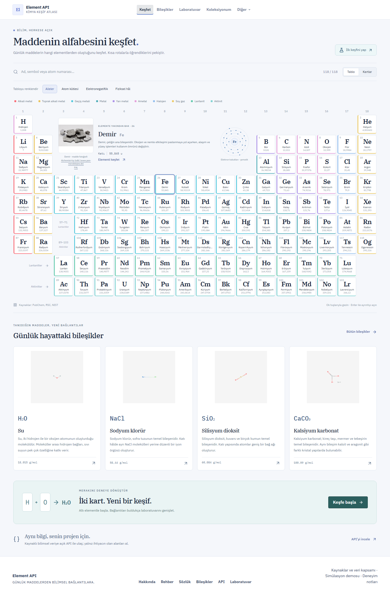
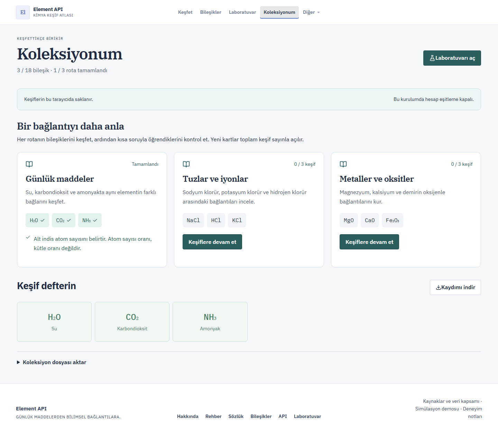
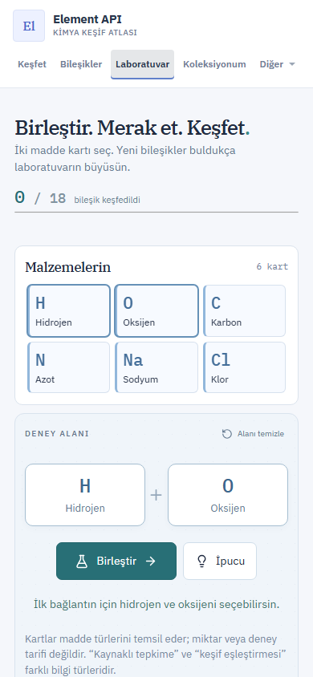

# Ürün dönüşümü — uygulama kaydı

15 Eylül 2026. Başlangıç değerlendirmesi: `PRODUCT-ROADMAP.md`. Son kapsam kararı: **yerelde sunuma hazırla**. Public beta, alan adı ve SMTP yayını bu teslimin dışında bırakıldı.

## Uygulanan değişiklikler

| Alan | Son davranış |
|---|---|
| Konumlandırma | Ana gezinme keşif, bileşik, laboratuvar ve koleksiyona odaklanır. API ikincil girişte; ticaret ayrı demo anlatımındadır. |
| Öğrenme | Altı rota, ön koşullu sorular, 167 bileşik için koleksiyon ve kalıcı ilerleme. İndirme/yeniden yükleme mevcut ilerlemeyi birleştirir. Formülü kur / Element dedektifi skorları ayrı yerel anahtardadır. |
| Mobil | İlk iki kart ve Birleştir eylemi 390×844 ekranda erişilebilir; aşama şeridi ana eylemin sonrasına taşındı. |
| Hesap | Varsayılan giriş/kayıt dönüşü koleksiyon. Kullanıcı bazlı yerel kayıt, açık misafir aktarımı ve sunucuda eklemeli eşitleme. |
| Güvenlik | Hatalı giriş kilidi; kullanıcı/cihaz başına anahtar davranışı; tekil eşzamanlı anahtar üretimi; 20 etkin anahtar sınırı; veritabanından güncel anahtar doğrulama. |
| Hesap yaşam döngüsü | Şifre değiştirme/kurtarma, e-posta doğrulama, veri indirme ve kapsamı açıklanmış hesap silme. Şifre değişimi ve anahtar iptali aynı transaction içinde. |
| E-posta | Yapılandırma yoksa kullanılabilirlik kapalı. Bir saatlik token; bağlantıda fragment, doğrulama çağrısında JSON gövdesi; token tekrar kullanım testi. |
| Veri dürüstlüğü | Boş bilimsel bölümler varsayılan gizli; null anlamı açık. Kapsam ve JSON Schema dosyaları kaynak snapshot'tan üretiliyor. Şema kimyasal doğruluk onayı değildir. |
| Hata yönetimi | Global hata ekranı, API kesintisinde temel atlas/laboratuvar, depolama kapalıyken oturum içi kayıt ve açık durum mesajları. |
| Ölçüm | Kullanıcı seçerse yalnız cihazda olay kaydı, 200 olay sınırı, kapatınca silme, notlarla dışa aktarım. Genel kullanıcı analitiği iddiası yok. |
| Çalıştırma | Bağımsız `science-service` + üretim web dosyaları tek süreçte. Dosyalar geçersizse başlangıç başarısız; çalışmayan v1 uçları JSON 404 döner. |
| Altyapı | .NET 10 hedef/runtime; web Docker context ve COPY düzeltmeleri; production ortamı ve geliştirme sırlarına karşı başlangıç denetimi; kalıcı mail-token anahtar dizini. |
| Kalite | CI workflow; gerçek API kullanan tarayıcı testleri; ayrı hesap arayüz sözleşme testleri; unit/integration ve JSON Schema doğrulaması. |

## Teknik kararlar

Salt okunur bilimsel kayıtlar zaten JSON snapshot'tan geliyordu. Bu nedenle ticaret servislerini topluca yeniden yazmak yerine aynı bilimsel kontrolcüleri bağımsız host'a bağladık. Ana ürün üç altyapı bileşeninin açılmasına bağlı olmadan gösterilebiliyor.

İlerleme, mevcut Identity kullanıcı-token tablosunda her keşif/rota için ayrı kayıtla saklanıyor. Eşzamanlı cihazlar birbirinin listesini ezmiyor. Ekleme sırası sabit ve işlemler transaction içinde. Bu model yarışma skoru/anti-cheat sistemi değildir; kullanıcı kendi öğrenme kaydını yönetir.

API anahtarlarının 24 saatlik pozitif önbelleği iptali geciktirebiliyordu. Doğrulama kimlik servisinin güncel veritabanı kaydını okur; Redis kota için kalır. Bu, kimlik servisine istek maliyeti getirir; küçük kurulum için doğruluk önceliklidir. Ölçüm olmadan dağıtık cache invalidation eklenmedi.

Eski `*Elx` API alanları ve saga event sözleşmeleri korunmuştur. Arayüzde para birimi sanal KREDI'dir.

## Doğrulama kaydı

Son kontrollerin sonuçları bu bölümde tutulur. Tarihsel başlangıç hataları güncel sonuç sayılmaz.

- Web: lint, üretim build ve 11 Node testi geçti.
- .NET: Release build bütün servis/test projelerinde geçti; 57 birim, 7 gateway ve 16 entegrasyon testi geçti. Son hesap değişiklikleri ayrıca hedefli çalıştırılır.
- Node sipariş: build ve ledger/compoundPrice/HTTP kontrolleri geçti.
- Java ödeme: Maven 3.9.9 + Java 21 konteynerinde 3 test geçti.
- Docker: yalnız web imajı temiz context'ten başarıyla derlendi; tam platform yeniden derlenmedi.
- Tarayıcı: hesap arayüzü için 8 sözleşme testi geçti. Bu testlerin HTTP yanıtları kontrollüdür; gerçek hesap davranışı PostgreSQL/Redis kullanan entegrasyon testleriyle doğrulanır.
- Bağımsız sunum paketi: health, coverage, schema, SPA, sitemap ve robots 200; kapalı v1 API 404; metadata'da çözülmemiş yer tutucu yok.

Üretim paketi üzerinde **18/18 masaüstü/mobil tarayıcı testi geçti**: gerçek kayıtlar ve şemalar, API playground, keşif/yenileme/rota, JSON koleksiyon aktarımı, isteğe bağlı yerel ölçüm, API kesintisi ve kapalı tarayıcı depolaması. Hesap mail-token değişikliği ve eşzamanlı 20 anahtar sınırı sonrası **6/6 hedefli entegrasyon testi** geçti.

Tam yerel kurulumda ayrıca **18/18 HTTP ticaret kontrolü**, **11/11 platform kontrolü** (sekiz servisin readiness/liveness/info uçları, web, REST ve gerçek SignalR olayı), **6/6 PostgreSQL saga kontrolü** geçti. Bilimsel API'nin veri, projection, ETag, CORS ve hata yanıtları doğrulandı. Gerçek tarayıcı testi kayıt → keşif → ikinci mobil oturumda eşitleme → sanal satın alma → teslimat → ilk cihazın anahtarının geçerli kalması akışını geçti. Bu test kontrollü HTTP taklidi kullanmaz.

Tam sunum adresi `http://localhost:3000` (`docker compose` / `present-platform.ps1`); bağımsız atlas `http://127.0.0.1:5080`. Durdur: `stop-local.ps1`.

## Sonraki iş

Öncelik artık yeni özellik miktarı değil, gerçek deneme: beş katılımcıyla ilk keşif ve rota akışını gözlemlemek, üç rotanın bilimsel metnini öğretmenle incelemek ve en büyük sürtünmeyi gidermek. Oturum soruları ve üç dakikalık gösterim `LOCAL-PRESENTATION.md` içinde. Canlı yayın/SMTP, sunucu seçildikten sonra ayrı doğrulama gerektirir.

## Görseller

Gerçek yerel sunum paketinden alınan ekranlar:

## Ön yüz teslimi — 15 Eylül 2026

shadcn/ui + Radix ortak bileşenleri, yeni yan gezinme ve mobil menü, sade görsel dil, tutarlı form/tablo/kartlar tamamlandı. 28 keşif/gezinti + 10 hesap arayüzü + 2 gerçek servis tarayıcı testi geçti. Ayrıntı [LOCAL-VERIFICATION.md](LOCAL-VERIFICATION.md). [12 senaryo](PRODUCT-SCENARIOS.md), [memory bank](memory-bank/README.md) ve [tasarım sistemi](memory-bank/design-system.md) güncel. Yeni arayüz http://localhost:3000 ve bağımsız atlas http://127.0.0.1:5080 adresinde.
15 Eylül ek doğrulama: SMTP hariç tüm yerel kontroller istendi; sunucu/alan adı henüz yok. Resend sağlayıcı tercihi kaydedildi. Gerçek hesap yaşam döngüsü tarayıcı testi ve beş veritabanında snapshot tabanlı geri yükleme provası eklendi; sonuç ve sınırlar [LOCAL-VERIFICATION.md](LOCAL-VERIFICATION.md) içinde.
