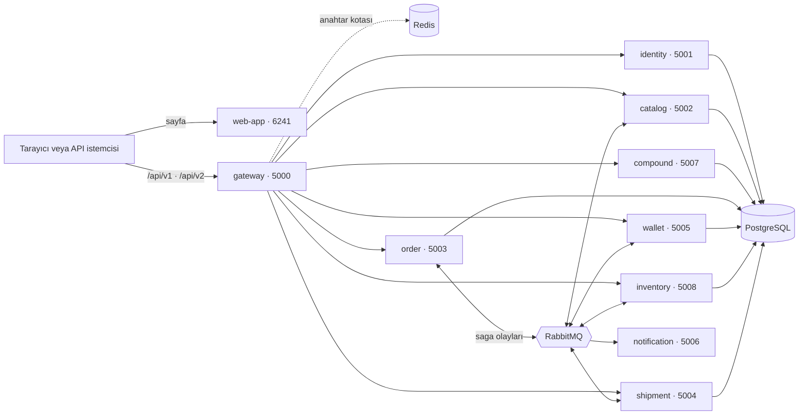

# ElementAPI sistem kılavuzu

> Ürünün her parçasının ne işe yaradığını, birbirleriyle nasıl konuştuğunu ve her dosyadaki her fonksiyonun ne yaptığını anlatan kılavuzun giriş sayfası.

| Özellik | Değer |
|---|---|
| Ürün | Türkçe kimya atlası: 118 element, 214 bileşik, laboratuvar, öğrenme rotaları, defter ve açık bilim API'si (v2) |
| Arayüz | `web-app`: React 19, TypeScript, Vite, Tailwind 4 |
| Servisler | .NET 10 (gateway, identity, catalog, compound, shipment, notification, science), Node.js 22 (order), Java 21 + Spring Boot (wallet, inventory) |
| Veri | PostgreSQL 16 (servis başına ayrı veritabanı), Redis 7 (yalnız gateway kotası), depoda tutulan bilimsel JSON snapshot'ları |
| Mesajlaşma | RabbitMQ 3, MassTransit JSON zarfı; sipariş saga'sı, fiyat ve satış olayları |

## Ürün nedir?

ElementAPI, elementten bileşiğe uzanan Türkçe bir kimya atlasıdır. Kullanıcı periyodik tabloda bir element bulur, kaynaklı bilimsel kaydını inceler, laboratuvarda elementleri birleştirip bileşik keşfeder, öğrenme rotalarını tamamlar ve ilerlemesini defterinde tutar. Aynı veriler herkese açık bilim API'sinden (`/api/v2`) alan seçimi, sayfalama ve ETag desteğiyle okunabilir.

Tam platformda bunlara ek olarak ayrı bir **sanal ticaret demosu** çalışır: piyasa, mağaza, cüzdan, sipariş ve kargo. Para birimi KREDI'dir; gerçek ödeme, gerçek para ve fiziksel teslimat yoktur. Hesaplar kapalı derlemede (`VITE_ACCOUNTS_ENABLED=false`, bağımsız atlas) bu bölüm hiç görünmez.

Bilimsel veri çalışma anında internetten çekilmez. `deploy/scripts/refresh-*.mjs` script'leri PubChem, RSC, NIST ve Wikimedia Commons'tan veriyi bir kez indirip depoya JSON olarak yazar; servisler yalnız bu dosyaları okur.

## Mimari

Tarayıcı sayfayı web-app'ten alır, bütün API isteklerini ise tek kapıdan, gateway'den yapar. Gateway isteğin yoluna bakıp doğru servise iletir; korumalı rotalarda API anahtarını identity'ye sorar ve arka servise kullanıcı kimliğini (`X-User-Id`) ve iç servis anahtarını (`INTERNAL_API_KEY`) ekler. Servisler birbirine yalnız bu iç anahtarla ulaşır.



Her servisin kendi veritabanı vardır ve başka bir servisin tablosuna dokunmaz. Servisler arası iş akışı RabbitMQ olaylarıyla yürür: olayı yayınlayan servis onu önce kendi veritabanına yazar (outbox), dinleyen servis aynı mesajı ikinci kez işlemez (`processed_messages`). Redis yalnız gateway'de, API anahtarı başına saniyelik kotayı saymak için kullanılır.

Bağımsız atlas (`science-service`, 5080) bu yapının dışında kalır: tek bir süreç hem web sayfasını hem de salt okunur `/api/v2` yanıtlarını sunar; veritabanı, broker ve hesap yoktur.

## Sipariş saga'sı

Mağazada "satın al" düğmesi bir sipariş açar; siparişin geri kalanı servisler arasında olaylarla ilerler. order-service bu akışın yöneticisidir (orkestratör), parayı ve stoğu kendisi tutmaz.

1. Tarayıcı `POST /api/v1/orders` isteğini gateway'e yollar. Gateway API anahtarını doğrular, isteğe `X-User-Id` ve `INTERNAL_API_KEY` ekleyip order-service'e iletir.
2. order-service gövdeyi ve `Idempotency-Key` başlığını doğrular; catalog'dan anlık alış fiyatını, inventory'den satılabilir gramı, compound'dan bileşik çarpanını alır, 50.000 KREDI tavanını ve cüzdan bakiyesini kontrol eder.
3. Sipariş, saga satırı ve ilk olaylar tek bir veritabanı işleminde yazılır; istemci hemen **202 Accepted** alır. Sipariş durumu: Submitted.
4. Outbox dağıtıcısı `OrderSubmittedEvent` yayınlar. inventory-service stoğu ayırır ve `StockReservedEvent` gönderir. Sipariş durumu: StockReserved.
5. order-service `PaymentRequestedEvent` yayınlar. wallet-service tutarı bakiyeden düşer ve `PaymentProcessedEvent` gönderir. Sipariş durumu: Shipping.
6. order-service `ShipmentRequestedEvent` yayınlar. shipment-service sahte bir kargo kaydı açıp takip numarası üretir ve `ShipmentDispatchedEvent` gönderir.
7. Sipariş Completed olur. `AssetsCreditedEvent` ile wallet alınan gramları kullanıcının varlıklarına (holdings) ekler; `OrderCompletedEvent` ile inventory ayrılan stoğu kesinleştirir ve catalog fiyatı alış yönünde biraz yukarı iter.
8. Her durum değişikliğinde `UpdateOrderStatusEvent` yayınlanır; notification-service müşterinin kayıtlı adreslerine imzalı `order.updated` webhook'u gönderir.

Herhangi bir adım başarısız olursa (stok yetmez, bakiye yetmez, kargo reddeder) sipariş **Failed** olur ve iki telafi olayı gider: `OrderStockReleaseEvent` ayrılan stoğu geri bıraktırır, `PaymentRefundRequestedEvent` çekilen KREDI'yi iade ettirir. Bir durumda fazla bekleyen siparişleri zaman aşımı süpürücüsü Failed yapar (Submitted ve StockReserved 120 sn, Shipping 180 sn). Failed bir siparişe geç gelen olay onu canlandırmaz; yalnız telafiyi yeniden ister.

## Yerelde çalıştırma

Tam platform Docker ile tek komutla açılır. Script `docker/.env` yoksa örnekten oluşturur, imajları derler ve adresleri yazdırır. `stop-local.ps1` verileri silmeden durdurur.

```powershell
./deploy/scripts/present-platform.ps1            # derle ve başlat
./deploy/scripts/present-platform.ps1 -NoBuild   # hazır imajlarla başlat
./deploy/scripts/present-local.ps1               # yalnız bağımsız atlas (5080)
./deploy/scripts/stop-local.ps1                  # durdur, veriler kalır
npm --prefix web-app run dev -- --host 127.0.0.1 --port 5173 --strictPort
```

Son satır, platform açıkken yalnız arayüz üzerinde çalışmak içindir: Vite çalışan gateway'e bağlanır, değişiklikler sayfayı yeniden yüklemeden görünür.

| Bileşen | Adres | Not |
|---|---|---|
| web-app | http://localhost:6241 | `WEB_HOST_PORT` ile değişir |
| Vite geliştirme sunucusu | http://127.0.0.1:5173 | `npm run dev`; gateway'i kullanır |
| gateway | http://localhost:5000 | Dışarıya açık tek API kapısı |
| identity · catalog · order | 127.0.0.1:5001 · 5002 · 5003 | Yalnız bu makineden |
| shipment · wallet · notification | 127.0.0.1:5004 · 5005 · 5006 | Yalnız bu makineden |
| compound · inventory | 127.0.0.1:5007 · 5008 | Yalnız bu makineden |
| Bağımsız atlas | http://127.0.0.1:5080 | `present-local.ps1` |
| PostgreSQL | 127.0.0.1:5432 | `POSTGRES_HOST_PORT` ile değişir |
| Redis | 127.0.0.1:6380 | Yalnız gateway kullanır |
| RabbitMQ | 127.0.0.1:5672 · 15672 | 15672 yönetim arayüzü |
| Public Dev · Test · Prod | http://localhost:8080 · 8081 · 8082 | `present-public.ps1`, Caddy arkasında |

## Test etme

| Komut | Ne yapar |
|---|---|
| `./scripts/test.ps1` | Tam kalite kapısı: web lint, test ve derleme, sipariş servisi kontrolleri, .NET derleme ve birim testleri; `-Integration`, `-Live`, `-Browser` eklenebilir. |
| `./scripts/lint.ps1` | Web ESLint ve sipariş servisi TypeScript derlemesi. |
| `npm --prefix web-app test` | Arayüzün birim testleri (Node test koşucusu); bu kılavuzun ayrıştırıcısı da burada sınanır. |
| `npm --prefix web-app run test:e2e` | Playwright tarayıcı testleri (atlas, laboratuvar, giriş). |
| `./deploy/scripts/test-unit.ps1` | Docker gerektirmeyen .NET birim testleri. |
| `./deploy/scripts/test-smoke.ps1` | Çalışan sisteme hızlı duman testi: katalog, yetki, satın alma, satış. |
| `node deploy/scripts/test-e2e.mjs` | Uçtan uca regresyon: idempotent sipariş, saga, holdings, eşzamanlı satış. |
| `node deploy/scripts/test-scientific-api.mjs` | Açık bilim API'sinin (v2) sözleşme kontrolü. |
| `dotnet test deploy/tests/Element.Services.IntegrationTests --filter "Category=Integration"` | Gerçek Postgres, Redis ve RabbitMQ konteynerleriyle entegrasyon testleri (Docker gerekir). |

Her servisin kendi testleri ve nasıl çalıştırıldığı o servisin sayfasındaki "Testler" bölümündedir.

## Bölümler

| Bölüm | Ne işe yarar |
|---|---|
| [API kapısı (gateway)](gateway.md) | Her HTTP isteğini karşılar, hız sınırı uygular, API anahtarını doğrular ve isteği doğru servise yönlendirir. |
| [Ortak kütüphane (shared-lib)](shared-lib.md) | .NET servislerinin paylaştığı olay sözleşmeleri, loglama, sağlık uçları ve bilimsel katalog motoru. |
| [Bilim atlası (science-service)](science.md) | Ticaret yığını olmadan atlası ve salt okunur v2 API'yi tek süreçte sunar. |
| [Katalog servisi (catalog-service)](catalog.md) | 118 elementin bilimsel kaydı, sanal KREDI fiyatı, kategoriler ve istatistikler. |
| [Bileşik servisi (compound-service)](compound.md) | Bileşikler, allotroplar, mağaza preparatları ve bilimsel bileşik kayıtları. |
| [Kimlik servisi (identity-service)](identity.md) | Hesaplar, oturumlar, API anahtarları, webhook kayıtları ve öğrenme ilerlemesi. |
| [Sipariş servisi (order-service)](order.md) | Alış emrini fiyatlar, kaydeder ve stok → ödeme → kargo saga'sını yönetir. |
| [Cüzdan servisi (wallet-service)](wallet.md) | KREDI bakiyesi, hareket defteri, holdings, ödeme, iade ve masaya geri satış. |
| [Stok servisi (inventory-service)](inventory.md) | Element başına gram stoğu; sipariş için ayırır, bırakır ve kesinleştirir. |
| [Kargo servisi (shipment-service)](shipment.md) | Ödenen siparişe sahte kargo kaydı açar ve takip numarası üretir. |
| [Bildirim servisi (notification-service)](notification.md) | Sipariş durumu değişince müşterinin adreslerine imzalı webhook gönderir. |
| [Altyapı ve operasyon](altyapi.md) | Docker Compose, script'ler, Caddy, Jenkins, entegrasyon testleri ve veri yenileme. |
| [Arayüz (web-app)](web-app.md) | Tarayıcıda çalışan React uygulaması: atlas, laboratuvar, defter, geliştirici sayfaları ve KREDI demosu. |

## Bu kılavuzu güncellemek

Kılavuz bu klasördeki Markdown dosyalarından oluşur ve uygulamada `/kilavuz` adresinde okunur. `web-app/scripts/write-guide.mjs` dosyaları `web-app/src/data/guide.json` dosyasına çevirir; `npm run dev`, `npm run build` ve `npm test` bunu kendiliğinden çalıştırır.

Her servis sayfası aynı kalıbı izler; kalıba uymayan dosyada script satır numarasıyla hata verir:

- `# Başlık (klasör-adı)` ve hemen altında `>` ile başlayan tek cümlelik özet.
- `| Özellik | Değer |` tablosu: Teknoloji, Port, Klasör, Veri, Mesajlaşma.
- `##` bölümleri: Ne işe yarar?, Uç noktalar, Mesajlar, Kod haritası, Yapılandırma, Testler.
- Kod haritasında her dosya için `###` ile ters tırnak içinde dosya yolu, bir satırlık amaç ve `| Fonksiyon | Ne yapar |` tablosu.

Tablo hücresinde düz çizgi karakteri gerekiyorsa `\|` yazılır. Başka bir kılavuz sayfasına bağlantı `[metin](order.md)` biçimindedir; henüz yazılmamış sayfaya verilen bağlantı uygulamada düz metin olarak görünür.
